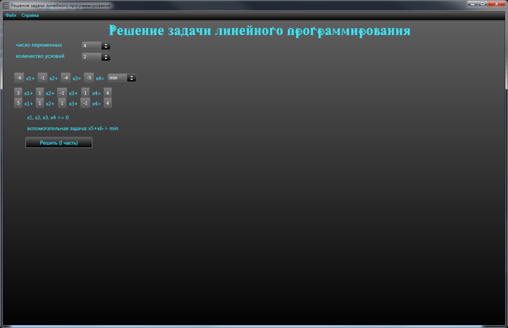
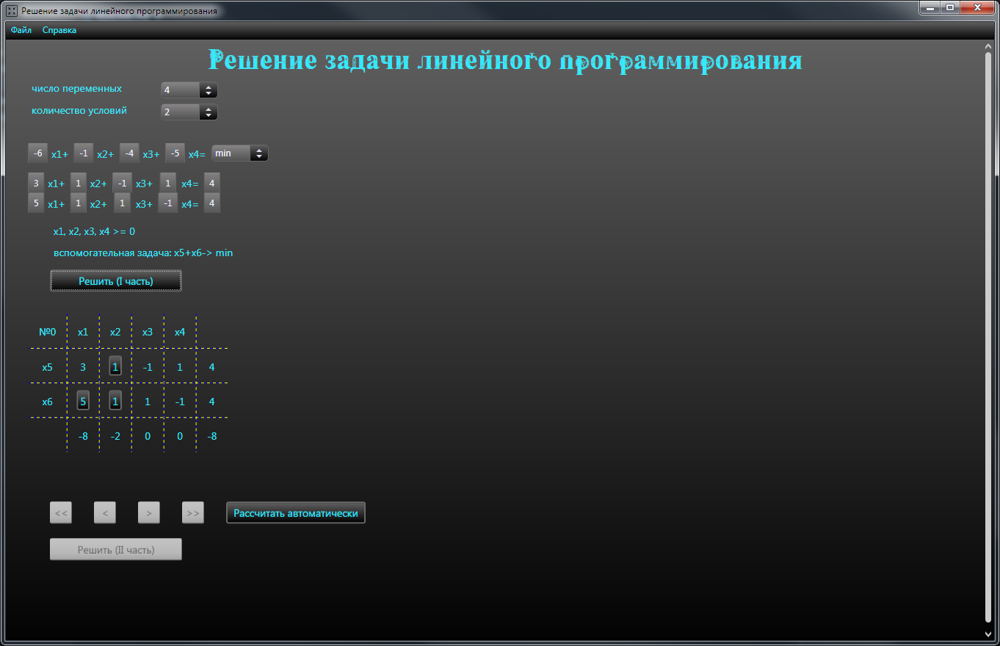
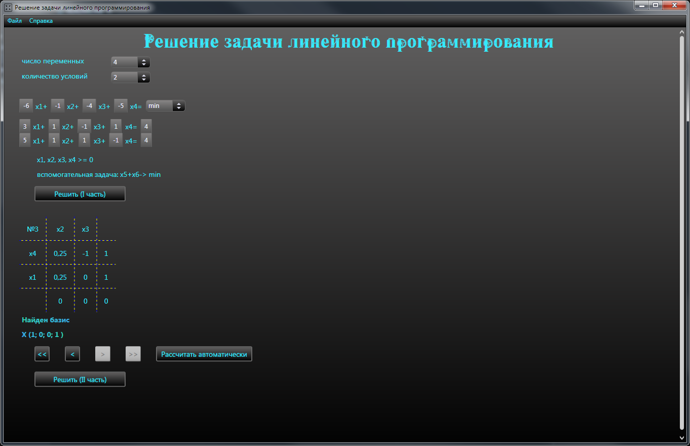
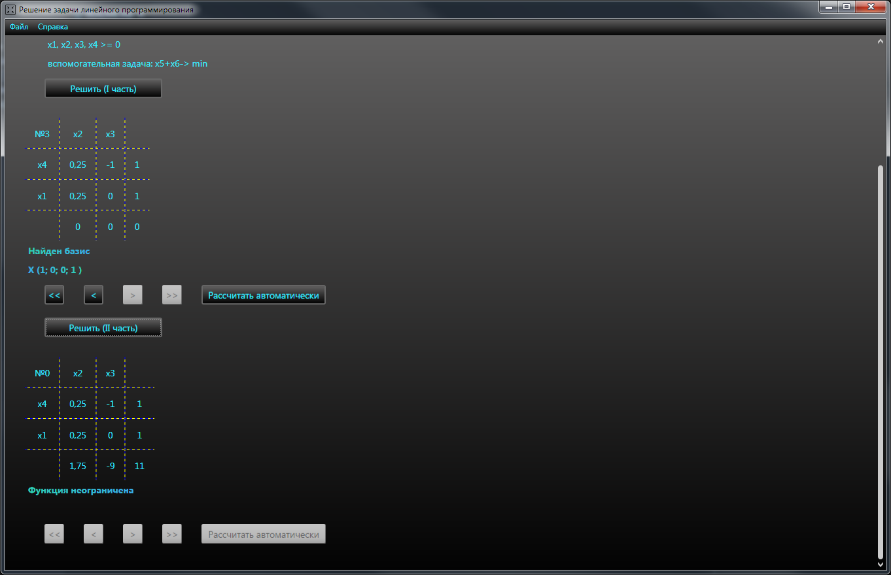
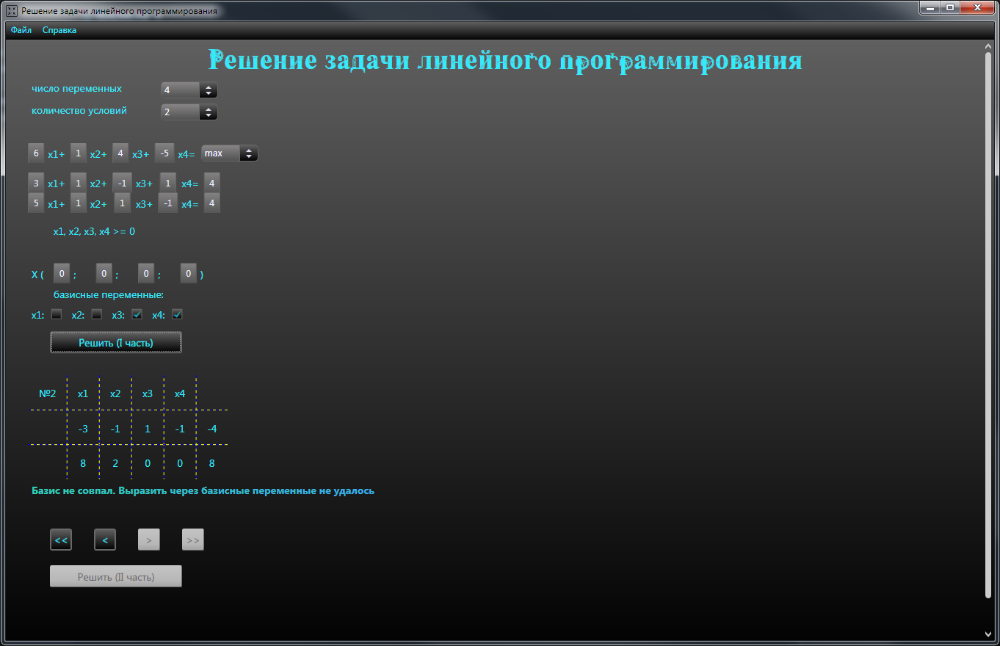
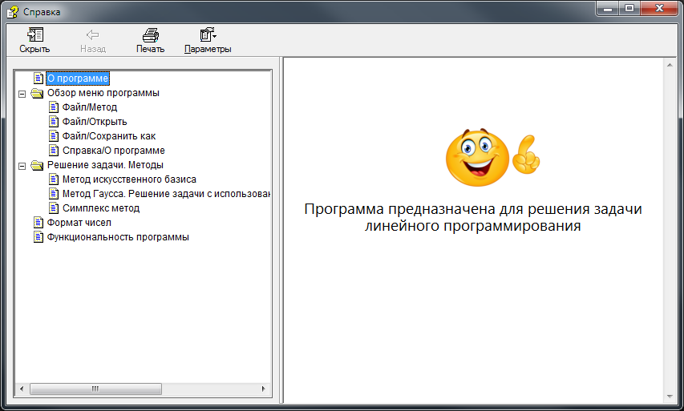

# Решение задачи линейного программирования

Номер регистрации (свидетельства):
[2019666308](https://www1.fips.ru/registers-doc-view/fips_servlet?DB=EVM&rn=6345&DocNumber=2019666308&TypeFile=html)

---

### Название программы для ЭВМ:
Решение задачи линейного программирования

### Реферат:
Программа, предназначенная для решения задачи линейного программирования. Функционал программы предлагает два подхода к решению задачи: 1) с помощью метода искусственного базиса; 2) с использованием заданных базисных переменных. После выбора необходимого метода пользователь вводит задачу одним из двух способов: либо загружает из файла, либо вводит данные вручную. Решение задачи разделено на две части. В зависимости от выбранного подхода в 1 части осуществляется поиск базиса с помощью метода искусственного базиса или выражение заданных базисных переменных из ограничений задачи с помощью метода Гаусса; 2 часть - решение задачи симплекс методом. Программа поддерживает два режима решения задачи: пошаговый, с возможностью выбора опорного элемента; автоматический. Управление параметрами программы осуществляется через главное меню. Тип ЭВМ: IBM PC-совмест. ПК; ОС: Windows 6.1 и более поздние версии.

### Язык программирования: 
С#

### Объем программы для ЭВМ: 
7,69 Мб

---

## Решение с помощью метода искусственного базиса

Исходные данные

    

1 часть решения

    

    

2 часть решения

    

## Решение с использованием заданных базисных переменных

    

## Справка

    

